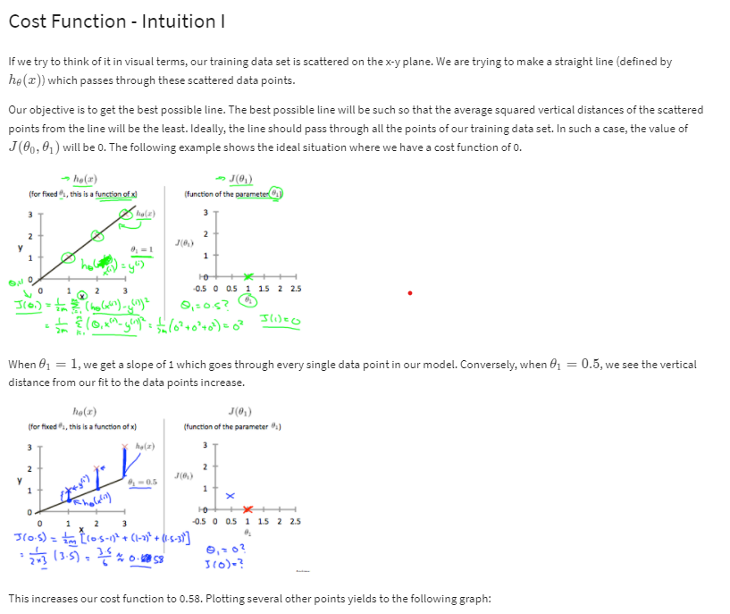
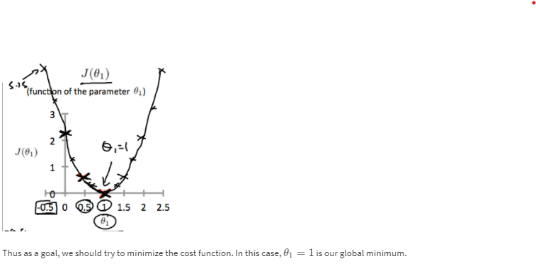
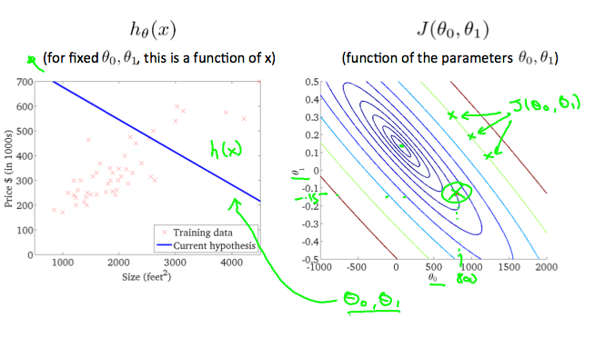
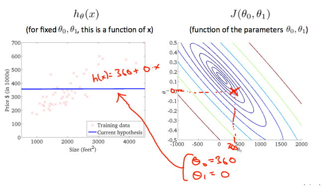
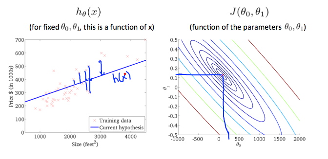

# Machine Learning Basics

When \(a \ne 0\), there are two solutions to \(ax^2 + bx + c = 0\) and they are
$$x = {-b \pm \sqrt{b^2-4ac} \over 2a}.$$

> A computer program is said to learn from **experience E** with respect to some **task T** and some **performance measure P**, if its performance on T as measured by P, improves with experience E

```Example: playing checkers.
E = the experience of playing many games of checkers
T = the task of playing checkers.
P = the probability that the program will win the next game
```

## Algorithms

- Supervised Learning
  We give the algorithm 'right answer' to learn
- Unsupervised learning
  Unsupervised learning allows us to approach problems with little or no idea what our results should look like. We can derive structure from data where we don't necessarily know the effect of the variables.
  We can derive this structure by clustering the data based on relationships among the variables in the data.
  With unsupervised learning there is no feedback based on the prediction results.

### Problems

- Regression: Predict continuous valued output
- Classification: Discrete valued output (0,1,...can be more options than two)

## Model & Cost Function

To describe the supervised learning problem slightly more formally, our goal is, given a training set, to learn a function h : X → Y so that h(x) is a “good” predictor for the corresponding value of y. For historical reasons, this function h is called a hypothesis. Seen pictorially, the process is therefore like this:


We can measure the accuracy of our hypothesis function by using a cost function. This takes an average difference (actually a fancier version of an average) of all the results of the hypothesis with inputs from x's and the actual output y's.


This function is otherwise called the "Squared error function", or "Mean squared error". The mean is halved (1/2) as a convenience for the computation of the gradient descent, as the derivative term of the square function will cancel out the (1/2) term. The following image summarizes what the cost function does:


### Cost Function Intuition I





### Cost Function - Intuition II

A contour plot is a graph that contains many contour lines. A contour line of a two variable function has a constant value at all points of the same line. An example of such a graph is the one to the right below.

**Taking any color and going along the 'circle', one would expect to get the same value of the cost function**. For example, the three green points found on the green line above have the same value for J($\theta_0$ ,$\theta_1$) and as a result, they are found along the same line. The circled x displays the value of the cost function for the graph on the left when
$\theta_0$ = 800 and $\theta_1$ = -0.15. Taking another h(x) and plotting its contour plot, one gets the following graphs:


When $\theta_0$ = 360 $\theta_1$ = 0, the value of J($\theta_0$,$\theta_1$)J($\theta_0$,$\theta_1$) in the contour plot gets closer to the center thus reducing the cost function error. Now giving our hypothesis function a slightly positive slope results in a better fit of the data.





## Parameter Learning

### Gradient Descent

So we have our hypothesis function and we have a way of measuring how well it fits into the data. Now we need to estimate the parameters in the hypothesis function. That's where gradient descent comes in.

Imagine that we graph our hypothesis function based on its fields $\theta_0$ and $\theta_1$
(actually we are graphing the cost function as a function of the parameter estimates). We are not graphing x and y itself, but the parameter range of our hypothesis function and the cost resulting from selecting a particular set of parameters.

We put $\theta_0$ on the x axis and $\theta_1$
on the y axis, with the cost function on the vertical z axis. The points on our graph will be the result of the cost function using our hypothesis with those specific theta parameters. The graph below depicts such a setup.


We will know that we have succeeded when our cost function is at the very bottom of the pits in our graph, i.e. when its value is the minimum. The red arrows show the minimum points in the graph.

The way we do this is by taking the derivative (the tangential line to a function) of our cost function. The slope of the tangent is the derivative at that point and it will give us a direction to move towards. We make steps down the cost function in the direction with the steepest descent. The size of each step is determined by the parameter α, which is called the learning rate.

For example, the distance between each 'star' in the graph above represents a step determined by our parameter α. A smaller α would result in a smaller step and a larger α results in a larger step. The direction in which the step is taken is determined by the partial derivative of J($\theta_0$,$\theta_1$). Depending on where one starts on the graph, one could end up at different points. The image above shows us two different starting points that end up in two different places.

The gradient descent algorithm is:

repeat until convergence:

$\theta_j$ := $\theta_j$ - $\alpha$ $\frac{\partial}{\partial \theta_j}$ J($\theta_0$, $\theta_1$)

where j=0,1 represents the feature index number.

At each iteration j, one should simultaneously update the parameters $\theta_1$, $\theta_2$,...,$\theta_n$. Updating a specific parameter prior to calculating another one on the j$^{(th)}$
iteration would yield to a wrong implementation.


### Gradient Descent Intuition

Let's simplify but optimizing only one dimension. One parameter.

Repeat until convergence:

$\theta_1$ := $\theta_1$ - $\frac{\partial}{\partial \theta_1}$ J($\theta_1$)

Regardless of the slope's sign for $\frac{d}{d \theta_1}$ J($\theta_1$),
$\theta_1$ eventually converges to its minimum value. The following graph shows that when the slope is negative, the value of $\theta_1$
increases and when it is positive, the value of $\theta_1$
decreases.

On a side note, we should adjust our parameter $\alpha$ to ensure that the gradient descent algorithm converges in a reasonable time. Failure to converge or too much time to obtain the minimum value imply that our step size is wrong.

The intuition behind the convergence is that $\frac{d}{d\theta_1}$ J($\theta_1$) approaches 0 as we approach the bottom of our convex function. At the minimum, the derivative will always be 0.


**Gradient descent can converge to a local
minimum, even with the learning rate $\alpha$ fixed**


## Multiple Features
